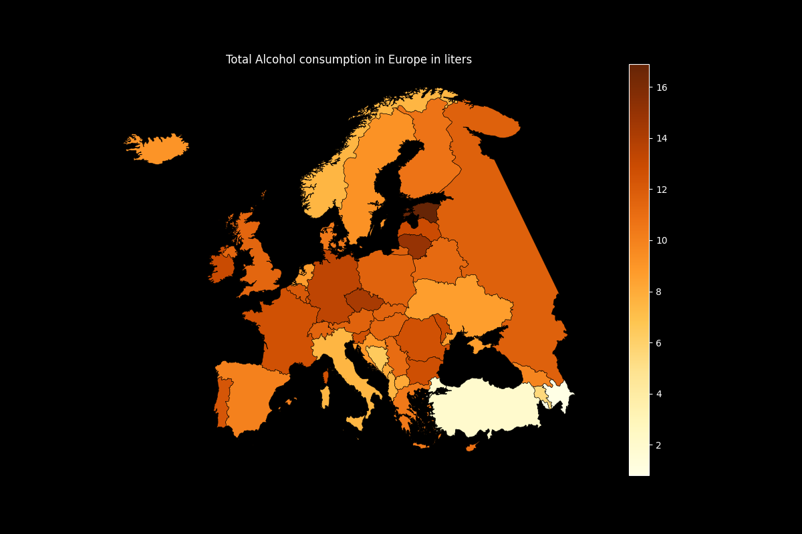

# Alcohol Consumption in Europe Data Project

## The project visualizes alcohol consumption patterns across Europe, focusing on various types of alcoholic beverages.

* This project aims to highlight the amount of pure alcohol consumed by citizens in different countries across Europe. The numbers are striking, and the project serves as a reminder of the importance of moderating alcohol consumption.

* We used a dataset from Kaggle and created a cleaner to extract the most important data, removing countries outside of Europe. This is a simple Jupyter notebook that presents the results. We also imported a GeoJSON map of Europe to visualize the data.

